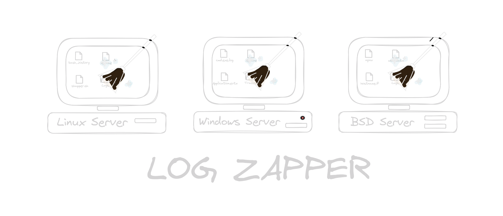

<h1 align="center">
   
  
</h1>

<h4 align="center">A high-quality log cleaner for pentesters and OPSEC teams.</h4>

    <a href="https://github.com/Rug4lo/Log-Zapper/commits/master">
    
    <a href="https://github.com/Rug4lo/Log-Zapper/issues">
    
    <a href="https://github.com/Rug4lo/Log-Zapper/pulls">
    

# Table of Contents

- [What is Log-Zapper?](#what-is-log-zapper)
- [How It works](#how-it-works)
- [Linux: Shapper](#linux-shapper)
  - [Usage](#linux-usage)
- [Windows: Pyapper](#windows-pyapper)
  - [Usage](#windows-usage) 
- [Solaris (Coming soon...)]()
- [BSD (Coming soon...]()
- [Disclaimer](#disclaimer)

# What is Log-Zapper?

Log-Zapper is a tool designed to securely delete all logs. This tool is intended to be used at the end of an audit to avoid leaving traces. Additionally, it collects information from the file so that after deletion, it creates a copy identical in modification date and size, but with corrupted content, to avoid raising suspicions.

# How It works

First, we detect all files that may contain information about events and activities occurring on a system, as well as backups of these files.

We use this detection along with the paths of the most common logs to delete them irretrievably.

We have employed several techniques to ensure the logs are impossible to recover after deletion:

- First, we erase all the information in the file. Then, we use the Gutmann method to overwrite the data on the hard disk multiple times with specific patterns to ensure the data is unrecoverable.
- After the Gutmann method, we overwrite 70% of the required times with unusual patterns, specifically overwriting the file with 1s.
- Finally, we overwrite 30% of the required times with zeros, making it harder to detect other overwritten patterns such as Gutmann's.

Once the file has been securely overwrited and deleted, we create a fake corrupted file with the same size as the original and a modification date prior to the execution of our tool, to avoid being detected.

# Linux: Shapper

Shapper is the Log-zapper tool made in Bash for Linux Based Distributions.
For user convenience the log-zapper is in a single file to be more agile when installing the program from the repository.

## Shapper Usage

First clone the repository:

    git clone https://github.com/Rug4lo/Log-Zapper
    cd Log-Zapper/Linux/

Move the tool in the machine you want to delete the logs, be sure you are root and give it privileges.

    chmod +x Shapper.sh

Then execute the Tool.

    ./Shapper.sh

Here the Linux Distro Based, in this case Debian Based, POC: 

# Windows: Pyapper

Pyapper is the Log-zapper tool made in Python for Windows OS.
At the moment we only have a python script, as time goes by we will be adding more scripts written in C, powershell, cmd and other programming languages. It is worth mentioning that when running the program it will ask for administration privileges, otherwise it will only delete a few logs.

_PD: Windows Defeder doesn't recognice it like a virus._

## Pyapper Usage
Before installing the program, make sure that python3.9 or higher is installed on the victim machine. If not the program will not work correctly.

After checking it, we clone the repository:

    git clone https://github.com/Rug4lo/Log-Zapper
    cd Log-Zapper/Windows/

Move the tool in the machine/windows server you want to delete the logs. And execute the program with python

    python ./Pyapper.py

Here the windows POC:

# Disclaimer

Any actions and or activities related to **LogZapper** is solely your responsibility. The misuse of this toolkit can result in criminal charges brought against the persons in question. The contributors will not be held responsible in the event any criminal charges be brought against any individuals misusing this toolkit to break the law.

This toolkit contains materials that can be potentially damaging or dangerous for some virtual private servers (VPS). Refer to the laws in your province/country before accessinng.

This Tool is made for educational purposes only. Do not attempt to violate the law with anything contained here. If this is your intention, then Get the hell out of here!
